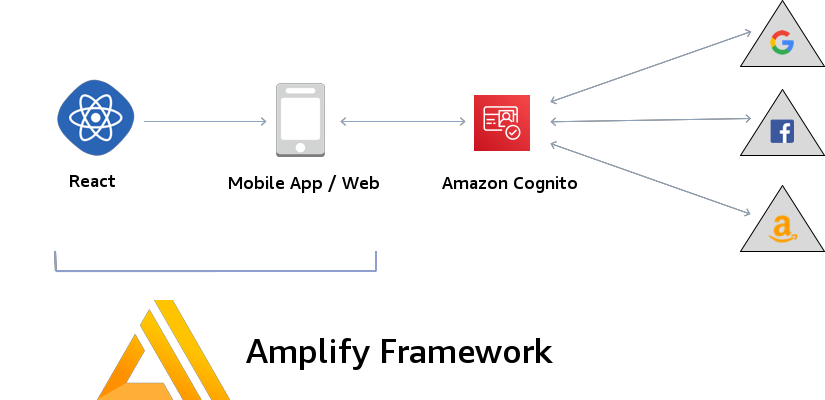

# MOB311 - The Complete Guide to User Authentication with the Amplify Framework
The AWS Amplify Authentication modules provide Authentication APIs and building blocks for developers who want to create apps with real-world production-ready user authentication. This session will dive deep into how the Amplify Auth component works and how to use it with Federation to give robust, secure access to your applications. 

## Architecture
In this workshop, you will gain experience working with the Amplify Framework and configuring authentication for a social identity provider (Facebook or Amazon Login for this workshkop). Step by step instructions are illustrated to show how to configure the chosen identity provider as well as guided steps to configure a sample web application to authenticate and use the credentials. The sample web application is a React application. To assist with the configuration of needed libraries a CloudFormation script will launch an EC2 instance that installs dependencies to complete the workshop.

## Initial environment setup

### Prerequisites

#### Laptop Machine
A laptop with Wi-Fi running Microsoft Windows or Mac OS X with the following software installed:
- An Internet browser such as Chrome, Firefox, Safari, or Edge.
- Ability to install Visual Studio Code
- Ability to SSH with port forwarding

#### AWS Account
- Ability to create AWS resources including EC2, Cognito and IAM Users.
- The Amplify configuration will create an IAM user with Administrative permissions.
- EC2 key pair created in the AWS region.
- Deploy resources in the us-west-2 region.

#### Social Federation Account
- You will need either a **Facebook** or **Amazon Account** to configure an identity provider.

:warning: **Important Note: This guide creates chargeable AWS resources.** You may wish to remove these resources upon completion of the guide to avoid incurring future charges to your account. To do this, be sure to follow the instructions in the *Clean up* module.

## Labs

Follow the modules to successfully configure and deploy the sample application to AWS.

| Labs |
| ------------- |
| [0 - Setting up AWS Tools and credentials](lab-0-tools/) |
| [1 - Configuring Social Identity Provider](lab-1-social/) |
| [2 - Creating the Amplify Project](lab-2-amplify/) |
| [3 - React Application and Amplify](lab-3-react/) |
| [4 - Okta (Optional Lab)](lab-4-okta/) |
| [99 - Clean up](lab-99-clean-up/) |

## License

This library is licensed under the MIT-0 License. See the LICENSE file.

