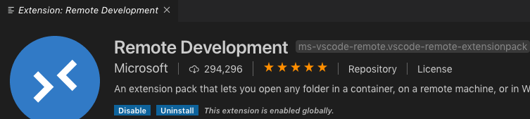

# Lab 0: Setup the AWS tools

## Deploy the Dev Environment

1. Launch the stack using the following CLI command below or clicking the **Launch Stack** button. The script creates the following AWS resources:
* VPC
* Subnet
* RouteTable
* SecurityGroup
* InternetGateway
* IAM User (optionally used for Amplify)
* EC2 Amazon Linux 2 Instance
    * t3.medium
    * 20Gb gp2 EBS volume
    * User Data scripts installs the following: python3, nodeJS, aws-amplify/cli, and create-react-app 

## Launch the stack

[](https://console.aws.amazon.com/cloudformation/home?region=us-west-2#/stacks/new?stackName=MOB311Dev&templateURL=https://aws-amplify-auth-workshops.s3-us-west-2.amazonaws.com/BuildMachine.yaml)

or run the command in the CLI:

Use the file **cfn-templates/BuildMachine.yaml** in this repository to launch the stack.

Note that the **YourKeyName** must be updated to one in your environment. To list your known keys, execute ``aws ec2 describe-key-pairs`` to list the ones in the current region.

```shell
aws cloudformation create-stack --stack-name MOB311Dev --template-body file://cfn-templates/BuildMachine.yaml --parameters ParameterKey=KeyName,ParameterValue=<Your KeyName Here> --region us-west-2  --capabilities CAPABILITY_IAM
```

> :notebook: The script will take approximately 5 minutes to finish.

2. While the stack is deploying, carry on to the next optional section and then to Lab 1.

## Configure Visual Studio Code
1. Install Visual Studio Code [Download](https://code.visualstudio.com)
2. Install the Remote Development Extension. This will allow you to SSH into the developer EC2 instance and remotely work in the file system. Details on the extension is [here](https://code.visualstudio.com/docs/remote/ssh).

3. Don't try and connect to anything yet. Instructions will be in Lab 3. Please continue to the next lab.


***You have now completed this lab and can move onto [Lab 1](../lab-1-social/).***

