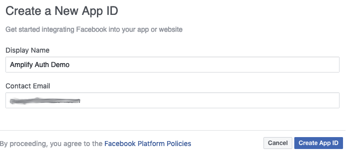
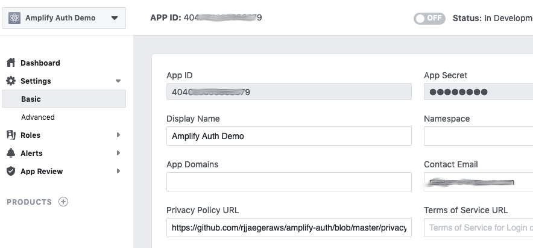
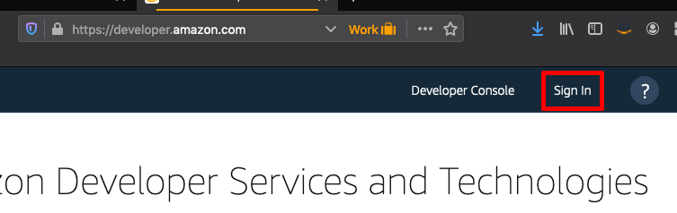
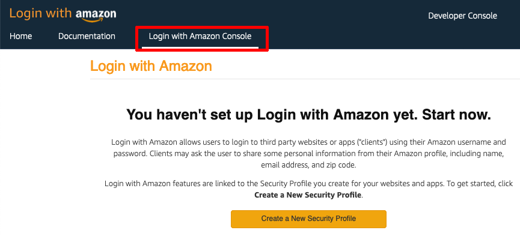
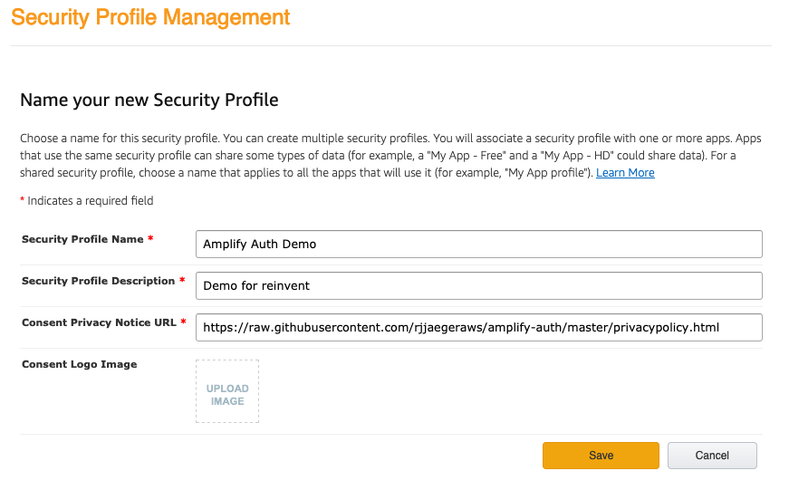
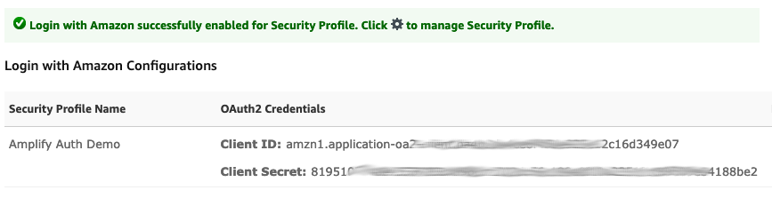

# Lab 1: Configure a Social Identity Provider 

For this workshop, you can follow the steps below to configure a **Facebook** or **Login with Amazon** identity provider. 

:notebook: You will need either a Facebook or Amazon account to continue.

## Facebook (Option 1)

1. Navigate to [https://developers.facebook.com](https://developers.facebook.com) and login with your Facebook credentials.

2. Under the **My Apps** menu, choose **Create App** and complete the necessary fields.

3. :exclamation: Navigate to the **Basic** settings page. Copy & paste the **App ID** and **App Secret** into a text file for later use.

4. The **Privacy Policy URL** is now a mandatory field. You can generate a policy [here](https://www.freeprivacypolicy.com/free-privacy-policy-generator.php) or reference the one the one in this Github repository ([privacypolicy.html](https://raw.githubusercontent.com/aws-samples/aws-amplify-auth-workshops/master/privacypolicy.html)). Click **Save Changes** after applying a policy url.

5. Keep this browser tab/window open. There will be more configuration in the next lab.

## Amazon Login (Option 2)

1. Navigate to [https://developer.amazon.com/](https://developer.amazon.com/) and login with your Amazon credentials.

2. Navigate to **Login with Amazon** found in the menu. 

3. Click the **Create a New Security Profile**. Complete the form by entering a **Name**, **Description**, and **Prvacy URL**. For the **Consent Privacy Notice URL** you can generate a policy [here](https://www.freeprivacypolicy.com/free-privacy-policy-generator.php) or reference the one the one in this Github repository ([privacypolicy.html](https://raw.githubusercontent.com/aws-samples/aws-amplify-auth-workshops/master/privacypolicy.html)). Click **Save** after applying a policy url.

4. :exclamation: Click the **Show Client ID and Client Secret** to reveal the values. Copy & paste the **Client ID** and **Client Secret** into a text file for later use.

5. Keep this browser tab/window open. There will be more configuration in the next lab.

***You have now completed this lab and can move onto [Lab 2](../lab-2-amplify/).***