# Lab 2: Configure Amplify 

## Connect to the Development Environment
1. Check the status of the CloudFormation stack. Wait until its Status is complete. Use the CLI command below or view the status in the AWS Console.

```shell
aws cloudformation describe-stacks --stack-name MOB311Dev --query 'Stacks[0].{StackStatus:StackStatus, Outputs:Outputs}' --region us-west-2
```

2. Login to the development box using SSH from within Visual Studio Code. Specify the appropriate private key and ``PublicIP`` from the EC2 instance. The SSH command below enables tunneling. This will allow your local computer to remotely connect on a specified port. For the purposes of this workshop, you will test the web application on http://localhost:3000. With this configuration, the traffic sent on port 3000 will be sent over the SSH tunnel to the target machine on port 3000.   

### Visual Studio Code (Mac or Windows)

1. Open Visual Studio Code. If the Remove Developer Extension is not installed, go back to [Lab-0](../lab-0-tools/) to see the installation instructions.

2. Navigate to the Remote Explorer extension.

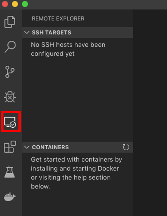

3. Click the gear icon next to the SSH Targets to create a configuration file. It will generate a new file with default values.

Select the default config file location. You will be presented with a default and blank configuration. Copy and paste either the Mac or Windows template (see below) into the configuration. The Mac/Windows are both provided to illustrate how the file paths are different.

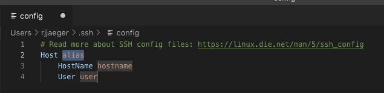

4. Replace the entry with values from the template below. Replace the **Host**, **HostName**, and **IdentityFile** with values from your environment and deployment. After saving the config, a SSH Target will appear. If not, close and reopen Visual Studio Code.

#### Mac
```
Host <ec2 public ip here ex: 35.162.249.241>
  HostName <ec2 public ip here ex: 35.162.249.241>
  IdentityFile "~/path/to/EC2PrivateKey.pem"
  User ec2-user
  LocalForward localhost:3000 localhost:3000
```
#### Windows
```
Host <ec2 public ip here ex: 35.162.249.241>
  HostName <ec2 public ip here ex: 35.162.249.241>
  IdentityFile "C:\Users\Administrator\path\to\EC2PrivateKey.pem"
  User ec2-user
  LocalForward localhost:3000 localhost:3000
```

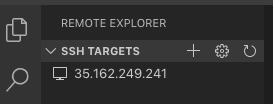


:notebook: If this is the first time saving the config file, confirm the warning message.


5. Click the **Connect to Host in New Window** icon next to the listed SSH Target. Take notice for the prompt to 'continue' the connection. After connecting, select **New Terminal** from the **Terminal** menu in Visual Studio Code. This will open a terminal session in the bottom panel of the window. You are now connected to your developer EC2 instance!

Example: Click **continue** when prompted.

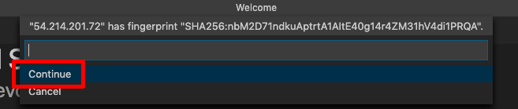

Example: Launch a new terminal session. This will launch a command window connected to the EC2 instance.

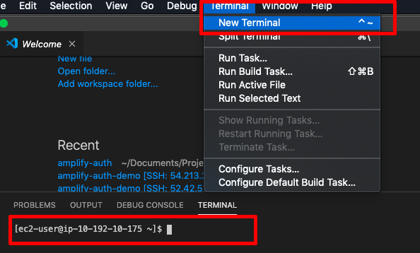


## Configure Amplify and Create the React project
1. Configure Amplify. Run ``amplify configure`` and follow the prompted instructions.

```shell
amplify configure
```
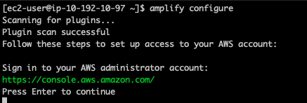

### Configure the Amplify IAM User

1. Sign in to your AWS administrator account and press ``Enter`` to continue and populate the prompted parameters with the values specified in the following table:

| Parameter | Value |
|---------|---------|
| region | us-west-2 |
| user name | amplify-qUL50 (default) |

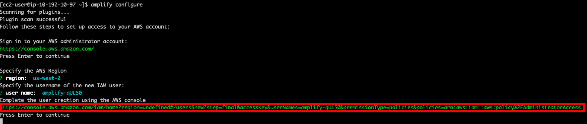

2. Copy the user creation url and paste into your web browser window that shows the AWS console. Keep the default values for the Add user wizard. Alternatively, you can use the IAM User created as part of the CloudFormation script. Check the CloudFormation Output details to find the AccessKeyId and SecretAccessKey needed in the next step. The difference is that the user created by the CloudFormation script is assigned a restrictive set of permissions instead of Administrator permissions. Skip to Step 4 if you are using this alternative method. 

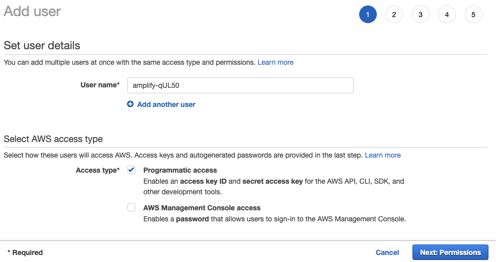

3. After creating the user, you will be presented with the user's Access key ID and Secret access key. You will need these two values in the following step. 

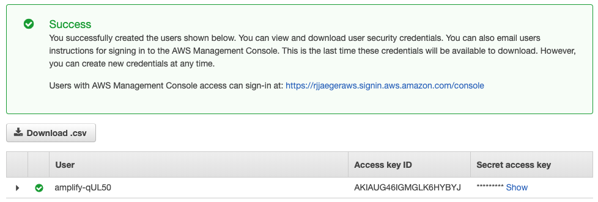

:warning: **Do not progress from this screen unless you have those values recorded**.


4. Return to the command window and complete the Amplify configure using the parameter values below:

| Parameter | Value |
|---------|---------|
| accessKeyId | *value from newly created user* |
| sescretAccessKey | *value from newly created user* |
| Profile Name | reinvent |

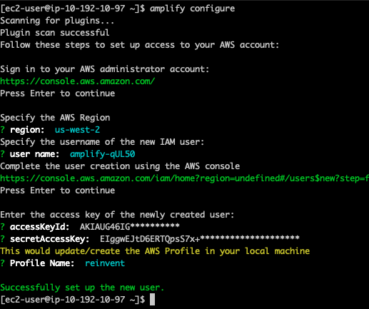

------


## Configure the React project

1. Create the React project and install the amplify framework. Run ``npx create-react-app amplify-auth-demo``

```shell
npx create-react-app amplify-auth-demo
```
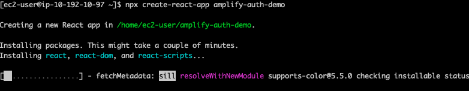

2. Install the ``aws-amplify`` package.
```shell
cd amplify-auth-demo
npm install aws-amplify
```
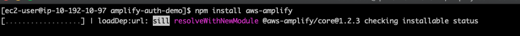

3. Initiate the Amplify project. This builds the necessary scaffolding to allow the configuration of additional features.
```shell
amplify init
```
| Parameter | Value |
|---------|---------|
| Enter a name for the project | amplifyauthdemo |
| Enter a name for the environment | dev |
| Choose your default editor | None |
| Choose the type of app that you're building | javascript |
|||
| What javascript framework are you using | react |
| Source Directory Path | src (default) |
| Distribution Directory Path | build (default) |
| Build Command | npm run-script build (defaut) |
| Start Command | npm run-script start (default) |
|||
| Do you want to use an AWS profile | Yes |
| Please choose the profile you want to use | reinvent |
|||

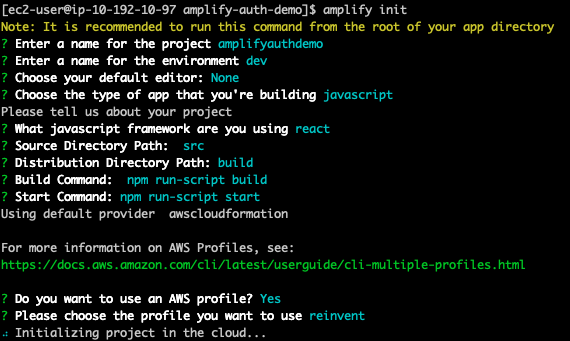

## Configure Amplify Authentication
1. Add authentication to the Amplify project ``amplify add auth``

Begin by running the following command and selecting the ``Default configuration with Social Provider (Federation)`` choice. The wizard will prompt you several times. Use the table below for the mapping of expected values. 

:warning: Deviation from the values listed below will result in issues in the next labs.

```shell
amplify add auth
```
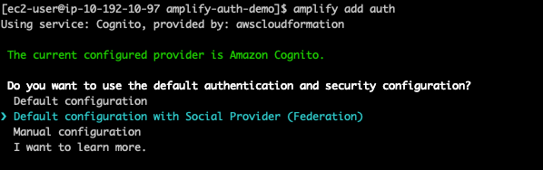

| Parameter | Value | 
|---------|---------|
| Do you want to use the default authentication and security configuration | Default configuration with Social Provider (Federation) |
||
| How do you want users to be able to sign in? | Email |
| Do you want to configure additional attributes? | Yes |
| What attributes are required for signing up? | Email, Name (use the arrow keys and Spacebar to select)|
| Do you want to enable any of the following capabilities? | *None* (just press enter) |
| What domain name prefix you want us to create for you? | amplifyauthdemo... (accept the default) |
| Enter your redirect signin URI | http://localhost:3000/ |
| Do you want to add another redirect signin URI | No |
| Enter your redirect signout URI | http://localhost:3000/ |
| Do you want to add another redirect signout URI | No ||
||

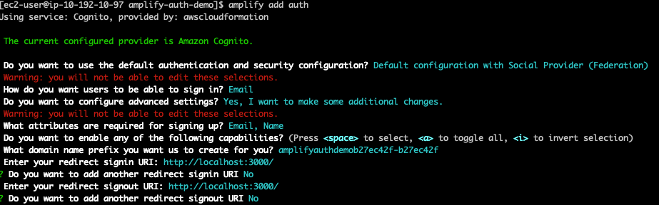

------

## Social Provider Configuration
We are now going to configure the Social Identity Provider. For this workshop you can select Facbook, Login with Amazon, or both. Choose the option for for the provider you used during the steup in Lab 1.

**Use *space* to select your choice.**
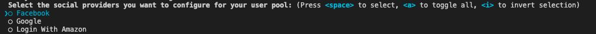

As an example, both Facebook and Login with Amazon have been selected. Choose the providers that you configued in Lab 1.

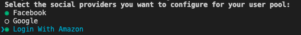


### Facebook (Option 1)

| Parameter | Value |
|---------|---------|
| Select the social providers you want to configure for your user pool | Facebook |
|||
| Enter your Facebook App ID for your OAuth flow | *value from your Facebook App ID* |
| Enter your Facebook App Secret fo your OAuth flow | *value from your Facebook App Secret* |
|||

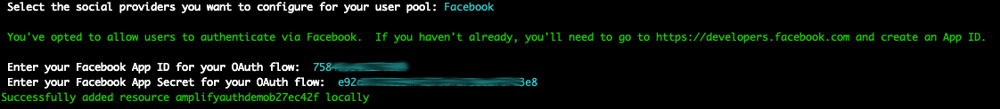

### Amazon Login (Option 2)

| Parameter | Value |
|---------|---------|
| Select the social providers you want to configure for your user pool | Amazon |
|||
| Enter your Amazon App ID for your OAuth flow | *value from your Client  ID* |
| Enter your Amazon App Secret fo your OAuth flow | *value from your Client Secret* |
|||

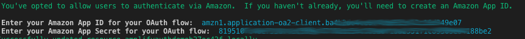

------

3. Push the changes to AWS. This command creates CloudFormation stacks that contain the necessary configuration with the parameter values specified above to configure the feature.

```shell
amplify push
```
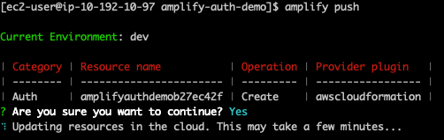

4. Configure the Social Provider with trusted domains with the Cognito endpoints.

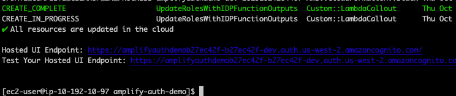


:notebook: **Note:** *The following Hosted UI Endpoint will be different in your environment. Make reference of yours in a separate notepad.* 
> Hosted UI Endpoint: https://amplifyauthdemob27ec42f-b27ec42f-dev.auth.us-west-2.amazoncognito.com/

## Configure the Social Provider App

### Facebook (Option 1)

1. Navigate to [developers.facebook.com](https://developers.facebook.com) and navigate to the **Basic Settings** page for your app.


2. Scroll to the bottom of the basic settings page and click the **+ Add Platform** button. Choose **Website**.

3. For the **Site URL** field, combine the **Hosted UI Endpoint** URI with **"oauth2/idpresponse"**. Click **Save Changes** when done.

Example:

 ``https://amplifyauthdemob27ec42f-b27ec42f-dev.auth.us-west-2.amazoncognito.com/oauth2/idpresponse``

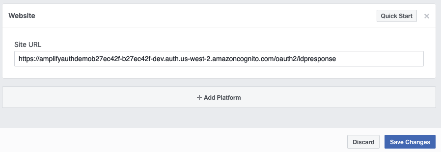


4. Copy and paste the **Hosted UI Endpoint** value from your environment and paste into the **App Domains** field. Click **Save Changes** when done.

Example:

``https://amplifyauthdemob27ec42f-b27ec42f-dev.auth.us-west-2.amazoncognito.com/``

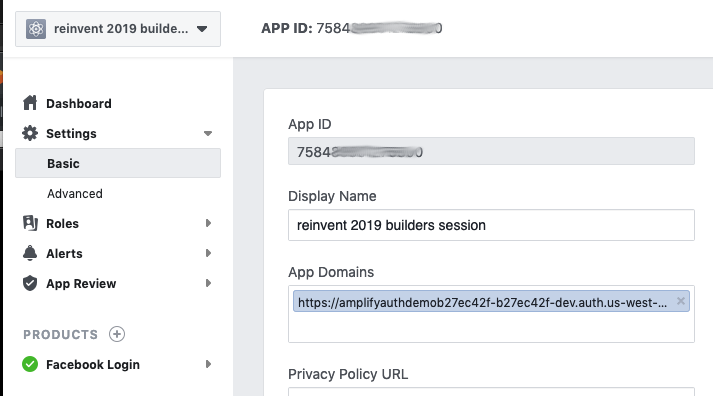

5. In the left navigation, click the **Products +** menu item and then add the **Facebook Login** product. Once added, navigate to its **Settings** page found in the left navigation.

6. In a text editor, combine the **Hosted UI Endpoint** URI with **"oauth2/idpresponse"** (The same value as used above for the Site URL). Copy and paste the combined URI into the **Valid OAuth Redirect URIs** field. Click **Save Changes** when done.

Example:

 ``https://amplifyauthdemob27ec42f-b27ec42f-dev.auth.us-west-2.amazoncognito.com/oauth2/idpresponse``


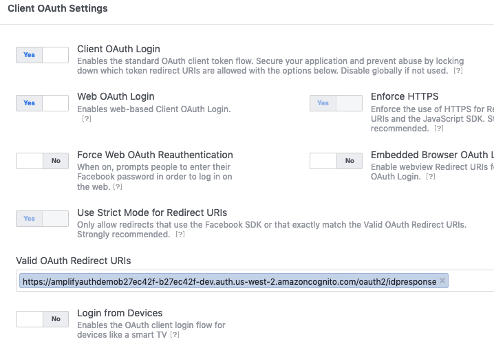

7. Configure a category (ex: Education) for the appication and then toggle the app status by switching the **On** toggle. 

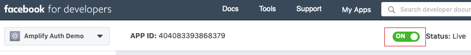


### Amazon Login (Option 2)

1. Navigate to [https://developer.amazon.com/](https://developer.amazon.com/) and login with your Amazon credentials.

2. Navigate to **Login with Amazon** found in the menu. Locate the **Security Profile** that you created in Lab 1. Under the **Manage** button, choose **Web Settings**.

3. Copy and paste the **Hosted UI Endpoint** value from your environment and paste into the **Allowed Origins** field.

Example:

``https://amplifyauthdemob27ec42f-b27ec42f-dev.auth.us-west-2.amazoncognito.com/``

4. In a text editor, combine the **Hosted UI Endpoint** URI with **"oauth2/idpresponse"** (The same value as used above for the Site URL). Copy and paste the combined URI into the **Allowed Return Urls** field. Click **Save Changes** when done.

Example:

 ``https://amplifyauthdemob27ec42f-b27ec42f-dev.auth.us-west-2.amazoncognito.com/oauth2/idpresponse``

5. Click **Save** when done.

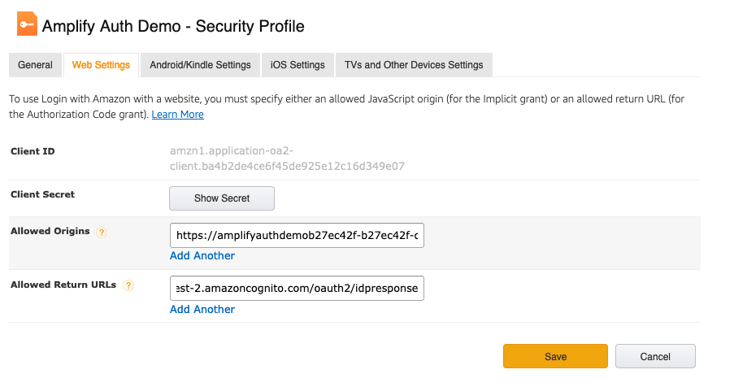

-----

## Test the Login

1. Locate the Test Hosted UI by running the following command:

```shell
amplify status
```

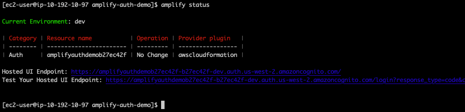

2. Open a web browser and paste the ``Test Hosted UI Endpoint`` into the browser. **Don't login in just yet**. 

:notebook: **Note:** *The following Test Hosted UI Endpoint will be different in your environment.* 
> Test your Hosted UI Endpoint: https://amplifyauthdemob27ec42f-b27ec42f-dev.auth.us-west-2.amazoncognito.com/login?response_type=code&client_id=1s4docfaiog4j0uei84kvu8uuo&redirect_uri=http://localhost:3000/

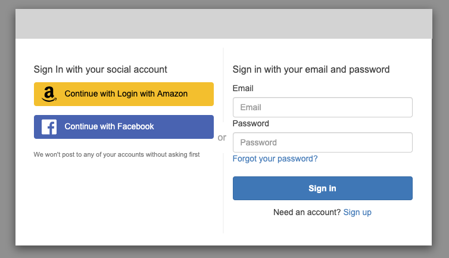


3. In the terminal, start the web server ``npm start``

```shell
npm start
```

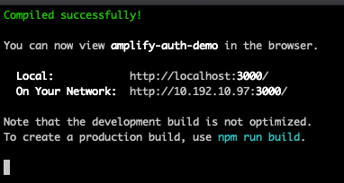

4. Once the web server is running, Click the **Continue with Facebook** or **Continue with Login with Amazon**

5. The first time you login, you will be prompted to **Allow** the application to access data from your profile. Notice how the values selected in the wizard (Name & Email) are presented as values that will be shared. Click **Allow** to continue. 

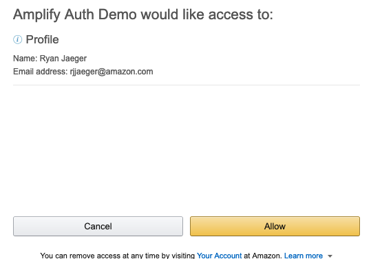

6. You should be redirected back to http://localhost:3000 after authenticating.  

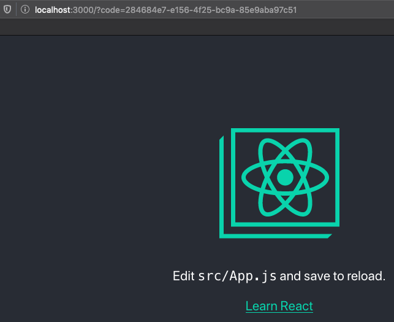

The Cogitno app has been configured to use the **Authorization code grant** OAuth 2.0 flow. At a high level, the flow has the following steps:

*  The application opens a browser to send the user to the OAuth server
*  The user sees the authorization prompt and approves the app’s request
*  The user is redirected back to the application with an authorization code in the query string
*  The application exchanges the authorization code for an access token

More details on the flow can be read here: https://aws.amazon.com/blogs/mobile/understanding-amazon-cognito-user-pool-oauth-2-0-grants/ 


Additional Links of interest:
*  https://aws.amazon.com/blogs/mobile/amplify-framework-adds-supports-for-aws-lambda-triggers-in-auth-and-storage-categories/

***You have now completed this lab and can move onto [Lab 3](../lab-3-react/).***
