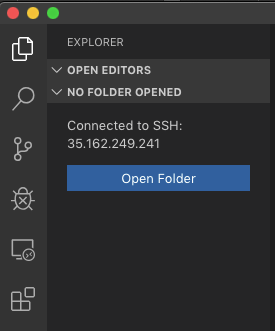
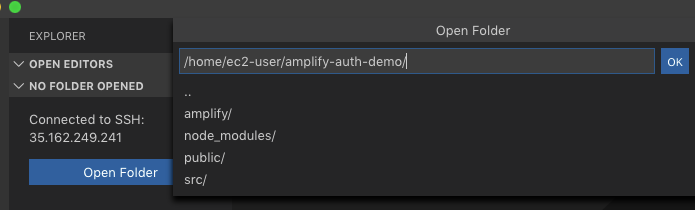

# Lab 3: React Application and Amplify

Amazon Cognito User Pools is a full-featured user directory service to handle user registration, authentication, and account recovery. 

Amplify interfaces with User Pools to store your user information, including federation with other OpenID providers like Facebook, Google, Login With Amazon, or SAML identity providers.


The preferred way to authenticate with a social provider is via an OAuth redirect which lets users login using their social media account. On successful authentication a corresponding user is created in User Pools. With this design you do not need to include an SDK for the social provider in your app. Amplify simplifies this by abstracting the complexisty. Using the ``amplify add auth`` and selecting the social provider option generates much of the needed configuration.. Upon completion you can use ``Auth.federatedSignIn()`` in your application to either show a pre-built "Hosted UI" or pass in a provider name (e.g. ``Auth.federatedSignIn({provider: 'Facebook'}))`` to interface directly and build out your own UI.

OAuth 2.0 (an open standard for access delegation) is the common Authorization framework used by web and mobile applications for getting access to user information ("scopes") in a limited manner. In the previous lab, we configued **Email** and **Name** as user information that will be requested. Common analogies you will hear in OAuth is that of boarding a plane or staying in a hotel - showing your identification is the Authentication piece (signing into an app) and using the boarding pass/hotel key is what you are Authorized to access.

OAuth support in Amplify uses Cognito User Pools and supports federation with social providers, which will automatically create a corresponding user in the User Pool after a login. OIDC tokens are available in the app after the application has completed this process.


* [Amplify JavaScript Authentication](https://aws-amplify.github.io/docs/js/authentication)
* [Amazon Cognito User Pools](https://docs.aws.amazon.com/cognito/latest/developerguide/cognito-user-identity-pools.html)
* [Hub](https://aws-amplify.github.io/docs/js/hub)

## Code editor
For the following sections requiring you to update code, you can use **vim**, **nano**, or **Visual Studio Code** if you followed the steps in Lab 0.

### Visual Studio Code
1. Ensure that you are remotely connected.

2. Click the **Files Explorer** from the left navigation.



3. Select the **amplify-auth0-demo** folder.



## React Application and Ampilfy

1. Configure the React application to the Amplify project. Insert the following code snippet after the last import in the file:  **src/index.js**.

### src/index.js
```javascript
import Amplify from 'aws-amplify'
import config from './aws-exports'

Amplify.configure(config)
```

## Add Sign Out and Listen for Authentication Events

Amplify has a local eventing system called Hub. It is a lightweight implementation of Publisher-Subscriber pattern, and is used to share data between modules and components in your app. Amplify uses Hub for different categories to communicate with one another when specific events occur, such as authentication events like a user sign-in. In the code below, the Hub is used in configured in the ``componentDidMount`` function. See
[Hub](https://aws-amplify.github.io/docs/js/hub) for more details.

:warning: If you are making changes to files while the web server is running and the page doesn't reflect the changes, stop and start the npm process.

Replace the **src/App.js** code with the following:

### App.js
```javascript
import React, { Component } from 'react';
import logo from './logo.svg';
import './App.css';

import { Auth, Hub } from 'aws-amplify'

class App extends Component {

    constructor(props) {
        super(props);
        this.state = {
            user: null,
        };
    }

    checkUser = () => {
        Auth.currentAuthenticatedUser()
        .then(user => {
            this.setState({ user: user}); 
            console.log(user);
        })
        .catch(err => console.log(err));
    }

    signOut = () =>  {
        Auth.signOut()
        .then(data => console.log(data))
        .catch(err => console.log(err));
    }

    componentDidMount = () => {
        //Hub Listener
        Hub.listen('auth', (data) => {
            const { payload } = data;
            console.log('A new auth event has happened: ', data);
            if (payload.event === 'signIn') {
                console.log('a user has signed in!');
                this.checkUser();
            }
            if (payload.event === 'signOut') {
                console.log('a user has signed out!');
                this.setState( {user: null} );
            }
        })
    }

    render() {
        const isLoggedIn = this.state.user != null;
        return (
            <div className="App">
                <header className="App-header">
                
                <p>
                    Edit <code>src/App.js</code> and save to reload.
                </p>
                <button onClick={() => Auth.federatedSignIn()}>Sign In</button>          
                <button onClick={this.signOut}>Sign Out</button>
                <div>
                {isLoggedIn ? (
                    <span>User:{this.state.user.attributes.email}</span>
                ) : (
                    <span>Not Logged In</span>
                )}
                </div>
                </header>       
            </div>      
        );
    }
}

export default App;
```


2. Run the application if it isn't already running.

```shell
npm start
```

3. Navigate to [http://localhost:3000](http://localhost:3000) and click the **Sign In** button. After logging in, you should be redirected back to the react site and you should see your email.


------

## Challenge Tasks
1. There is a bug in the above code. Can you fix it? After you log in, refresh the page. Notice how the logged in session is lost. What code needs to be added so this doesn't happen and the session is maintained?

2. The Cognito Hosted UI presents both the Social providers and the Cognito User Pool sign in. Remove the Cognito User Pool sign in so that only the Social providers are displayed.

3. Let's bypass the Cognito Hosted UI completely. When the 'Sign In' button is pressed, go directly to a social provider login (either Facebook or Amazon).

4. In addition to the user's email address being displayed, add code to display the user's name. 

***Congratulations! You have now completed this builder exercise. When ready, you can move onto [Cleanup](../lab-99-clean-up/).***

or

continue to the optional lab 4 [here](../lab-4-okta/).
