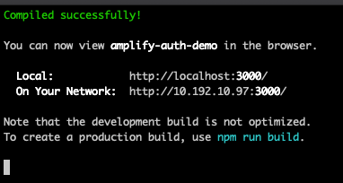

# Lab 4: Okta
Amazon Cognito supports authentication with identity providers through Security Assertion Markup Language 2.0 (SAML 2.0). In this section, you will configure Okta as a SAML identity provider for Cognito.

For this lab, you will need to have or create an Okta account with administrator permissions.

## Register for a trial Okta account
- https://www.okta.com/free-trial/


### Create an Okta Application
1. Create an application in Okta. Click **Add Application** by first navigating to **Admin -> Applications**


2. Select **Web** from the Platform dropdown and **SAML 2.0** for the Signon method.


3. Provide a name for the application. Example **Amplify Auth Cognito Demo**


4. Configure the application with the following values from your Cognito application.


| Setting | Example | Notes |
| --- | --- | --- |
| Single sign on URL | https://amplifyauthdemoa530dea3-a530dea3-dev.auth.us-west-2.amazoncognito.com/saml2/idpresponse | This is the Cognito hosted URL from your application. Note the ending is **saml2/idpresponse**. |
| Audience URI (SP Entity ID) | urn:amazon:cognito:sp:us-west-2_b5UiiKU3g | This is an identifier in a specific format: urn:amazon:cognito:sp:**yourUserPoolID** |
| Application username | Email | Specify email for this value |

5. Configure the optional Attibute Statements for the application


| Name | Name format | Value |
| --- | --- | --- |
| http://schemas.xmlsoap.org/ws/2005/05/identity/claims/emailaddress | URI Reference | user:email
| http://schemas.xmlsoap.org/ws/2005/05/identity/claims/name | URI Reference | user:firstName |
| http://schemas.xmlsoap.org/ws/2005/05/identity/claims/username | URI Reference | user:login |

6. Click **Next** and complete the following form that inquires about how the app is used. 

7. Navigate to the **Assignments** tab and **Assign** your test user to the application.

8. Navigate to the **Sign On** tab and click the **View Setup Instructions** button.
 

9. Scroll to the bottom and copy and paste the IDP xml metadata document into a local file and save on your desktop.
.

10. From the AWS Console, navigate to **Cognito** and click the **Manage user Pools** button.  

11. Navigate to your Cognito User Pool for your application.

12. Using the left navigation, select **Federation -> Identity providers --> SAML**

13. Create a new SAML provider and give it a name (ex: 'OktaAmplifyAuth'), upload the xml document from the previous step, and select **Enable IdP sign out flow**.


14. Click **Create provider** after popluting the required values.

15. Using the left navigation, select **Federation -> Attribute mapping**

16. Select the **SAML** tab and ensure that your created application is selected in the drop down.

17. Configure two SAML attributes using the values in the table below.


| Capture | SAML Attribute | User pool attribute |
| --- | --- | --- |
| X | http://schemas.xmlsoap.org/ws/2005/05/identity/claims/name | Name |
| X | http://schemas.xmlsoap.org/ws/2005/05/identity/claims/emailaddress | Email |

18. Click **Save changes**

19. Using the left navigation, select **App integration -> App client settings**.

20. Locate the App client ending in **_clientWeb** and select th newly configured SAML provider. (ex: **OktaAmplifyAuth**).


21. Click **Save Changes**


### Configure Single Logout Feature (Optional)
The following steps will configure the Single Logout feature.
1. Navigate to your Cognito User Pool.

2. Select **Federation -> Identity providers --> SAML**

3. From the **Active SAML Providers** section, click the **Show signing certificate**


5. Copy the content of the signing certificate and paste into a new file on your local machine.

6. Add **----- BEGIN CERTIFICATE-----** as line 1 in the file.

7. Add **----- END CERTIFICATE-----** as line 3 in the file.

8. Save the file as **cognitosigningcertificate.pub**.


9. Navigate to your Okta application. **Admin -> Applications**

10. Select your application from the list.

11. From the **General** tab, click **Edit** in the **SAML Settings** section.

12. Click the **Show Advanced Settings** link within the **General** section.

13. Select the **Enable Single Logout** checkbox.

14. Configure the Single Logout with the following values from your Cognito application.


| Setting | Example | Notes |
| --- | --- | --- |
| Single Logout URL | https://amplifyauthdemoa530dea3-a530dea3-dev.auth.us-west-2.amazoncognito.com/saml2/logout | This is the Cognito hosted URL from your application. Note the ending is **saml2/logout**. |
| SP Issuer | urn:amazon:cognito:sp:us-west-2_b5UiiKU3g | This is an identifier in a specific format: urn:amazon:cognito:sp:**yourUserPoolID** |
| Signature Certificate | cognitosigningcertificate.pub | This is the file you created in **step 8**. Use the **Browse..** button to find the file, and then the **Upload Certificate**. If there is an error, you will have to scroll to the top to see the message. |

15. Click **Next** and accept defaults to ensure settings have been saved.

16. Navigate to the **Sign On** tab and click the **View Setup Instructions** button.
 

17. Scroll to the bottom and copy and paste the IDP xml metadata document into a local file and save on your desktop. 
.

If you look closely, this file has changed to include new information about the Single Logout.


18. The SAML provider needs to be updated. From the AWS Console, navigate to **Cognito** and click the **Manage user Pools** button.  

19. Navigate to your Cognito User Pool for your application.

20. Using the left navigation, select **Federation -> Identity providers --> SAML**

21. Locate the **OktaAmplifyAuth** active SAML provider and click the edit button (pencil icon).

22. Delete the existing **Metadata document** and upload the new one from the previous step.

23. Click **Update provider**


### Test the Okta SAML provider

1. In the terminal of your Visual Studio Code session, start the web server ``npm start`` if it isn't started.

```shell
npm start
```



2. Navigate to ``http://localhost:3000/`` and click the **Sign in** button.

3. On the Cognito Hosted UI, you should now see a button for the Okta provider.


4. Click the button and provide the credentials for your Okta login. After successfully authenticating, you should be redirected back to your application with your email and name displayed. Success!

5. Click the **Sign Out** button. Note: if you didn't complete the optional Sign Out feature above, skip the remaining steps.

6. Login to Okta with your administrator account and navigate to the **Admin** settings.

7. Click the **Reports -> System Log** menu item from the top navigation bar.

8. Validate that you see the Sign out log entry.


***Congratulations! You have now completed this builder exercise. When ready, you can move onto [Cleanup](../lab-99-clean-up/).***
