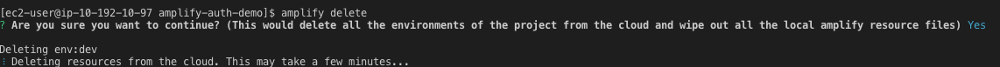
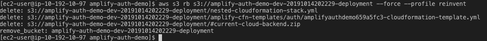
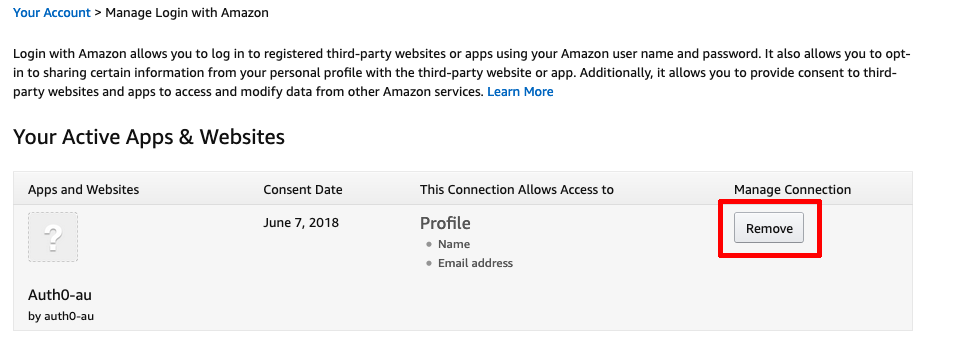
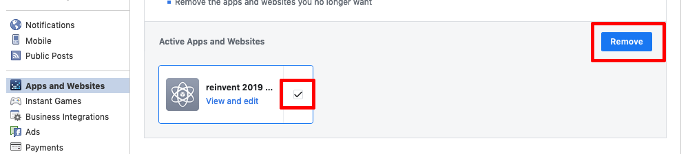

# Clean up

1. Delete the Amplify Environment. Run ``amplify delete`` from within the development environment.
```shell
amplify delete
```



2. Delete the S3 bucket that was created to store the Amplify configuration.

List all the buckets:
```shell
aws s3api list-buckets --profile reinvent --query 'Buckets[?starts_with(Name, `amplify-amplifyauthdemo`)].Name' --output text
```

Locate the bucket and delete it.

```shell
aws s3 rb s3://bucket-name --force --profile reinvent
```




3. After the Amplify Environment is deleted, logout of the EC2 instance, and delete the development environment using the credentials as was used to create it. Alternatively, navigate to the AWS Console, CloudFormation, and delete the stack.
```shell
    aws cloudformation delete-stack --stack-name MOB311Dev --region us-west-2 --profile reinvent
```

You can monitor the status of the delete with this command:

```shell
aws cloudformation describe-stacks --stack-name MOB311Dev --query 'Stacks[0].StackStatus' --region us-west-2 --profile reinvent
```

4. Clean up the Facebook or Amazon app that was created earlier.

5. Using the AWS Console, delete the IAM User created as part of the Amplify Configure step in Lab 2.

6. Revoke Access to the app from your Amazon or Facebook account

  * To revoke a site's access to your information:
     * Login with Amazon
       * Go to Amazon.com and click **Your Account**.
       * Under the **Other Accounts** section, select **Login with Amazon**.
       * To revoke future access of a third-party, click Remove. 
       * 

     * Facebook
       * Go to Facebook.com and click **Settings** from the dropdown in the welcome menu bar
       * Navigate to **Apps and Websites**
       * Select the application and click **Remove**
       * 


